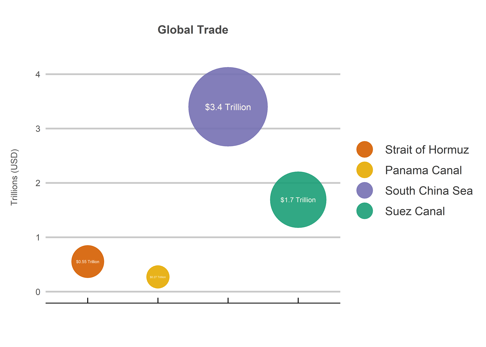
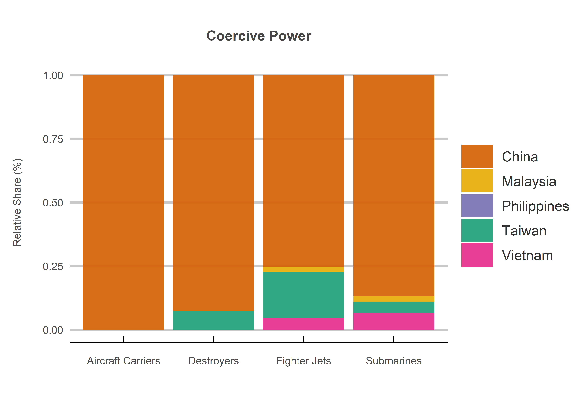
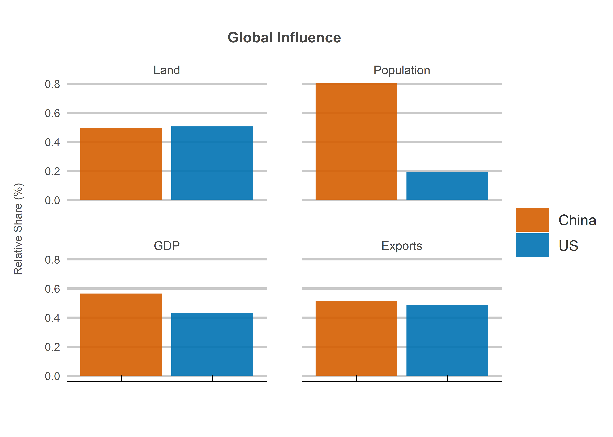
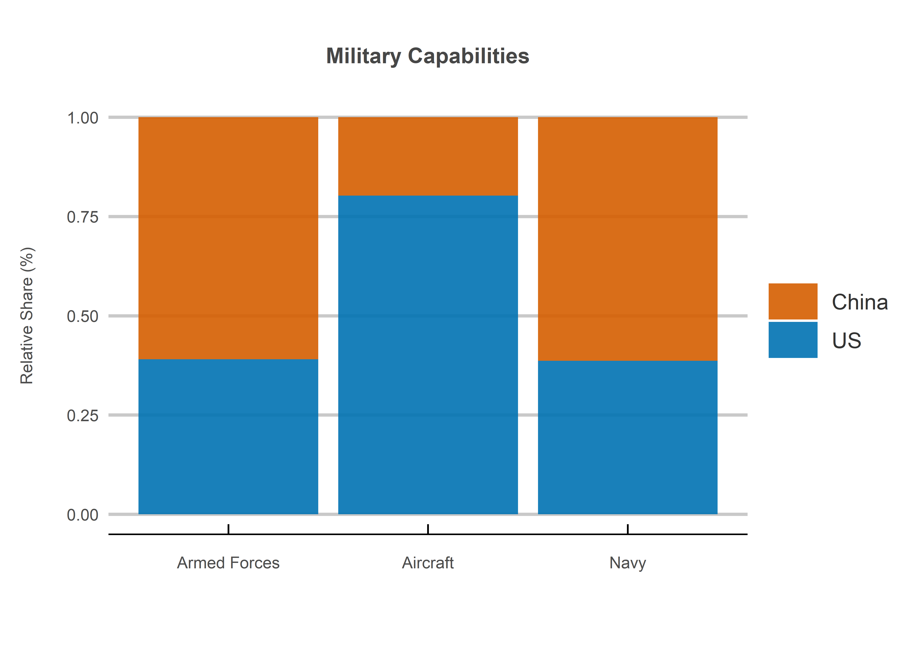

The South China Sea
================
Jack Carter
1/9/2021

## **Executive Summary**

The South China Sea is a region of great strategic importance. This has
led to a series of increasingly contested maritime claims between China,
Malaysia, the Philippines, Taiwan and Vietnam in recent decades. China’s
dominance has prompted the US to step up its regional military presence
to maintain the balance of power since 2012. Yet the US’s current
military advantage could be short lived if China’s economy continues to
grow in the future.

The rest of the report analyzes the dispute in the context of the
region’s strategic importance, China’s dominance over the other
claimants and the China-US balance of power. It is organized into the
following sections:

1.  The Region
2.  The Claimants  
3.  The Superpowers

 

## **1. The Region**

1.1: Approximate value of the region from various sources *(CSIS, 2016:
CSIS, 2021: Teh et.al., 2019)*.

<!-- -->

1.2: Approximate trade cargo value in trillions of US Dollars *(CSIS,
2016: Allianz, 2016: Osler, 2019: Kenawy, 2015)*.

<!-- -->

1.3: Approximate oil cargo volume in millions of barrels per day in 2016
*(EIA, 2017)*.

<!-- -->

## **Regional Summary**

The region is characterized by tremendous strategic importance due to
its abundance of estimated oil and gas reserves, fish supplies and
international trade flows.

Yet while hydrocarbon reserves and fish supplies may be significant,
they are easily overshadowed by the value of international trade. The
region is not only home to the world’s largest international trade
flows, but also the second largest crude oil flows. This makes it a
crucial choke point in the global economy and thus a vital national
interest.

 

## **2. The Claimants**

2.1: The relative share of regional trade by exports and imports in 2016
*(CSIS, 2016)*.

<!-- -->

2.2: Regional influence by total land, population, GDP and military
spending in 2021 *(Global Firepower, 2021)*.

<!-- -->

2.3: The relative share of military spending between 1990 and 2019
*(World Bank, 2019)*.

<!-- -->

2.4: The relative share of military capabilities by personnel, aircraft
and navy in 2021 *(Global Firepower, 2021)*.

<!-- -->

## **Claimant Summary**

The claimants are characterized by a high degree of inequality in both
size and capabilities. China has by far the largest regional trade
flows, landmass, population, GDP and military resources.

This suggests that the dispute is highly one-sided in terms of raw
power, an intuition borne out by the fact that China has now militarized
more islands than all of the other claimants combined. It is for this
reason that the US has stepped up its regional military presence since
2012.

 

## **3. The Superpowers**

3.1: The relative share of regional trade by exports and imports in 2016
*(CSIS, 2016)*.

<!-- -->

3.2: Global influence by total land, population, GDP and military
spending in 2021 *(Global Firepower, 2021)*.

<!-- -->

3.3: The relative share of military spending between 1990 and 2019
*(World Bank, 2019)*.

<!-- -->

3.4: The relative share of military capabilities by personnel, aircraft
and navy in 2021 *(Global Firepower, 2021)*.

<!-- -->

## **Superpower Summary**

The US appears to depend far less on regional trade, suggesting that its
increased military presence may be more an attempt to contain a rising
China rather than to secure its economic interests.

While the balance of power currently appears to be in the US’s favor,
China’s much larger population means that this could change quickly if
its economy continues to grow in the future. This is especially relevant
for the prospect of future conflict, as China would be operating in
waters closer to home and thus likely have a strategic advantage.

 

## **Sources**

  - Allianz (2016)
    <https://www.agcs.allianz.com/news-and-insights/reports/panama-canal-expansion.html>

  - CSIS (2016) <https://chinapower.csis.org/>

  - CSIS (2021) <https://amti.csis.org/>

  - EIA (2017) <https://www.eia.gov/todayinenergy/detail.php?id=39932>

  - Global Firepower (2021) <https://www.globalfirepower.com/>

  - Kenawy (2015) <http://oaji.net/articles/2017/3667-1488117386.pdf>

  - Osler (2019)
    <https://lloydslist.maritimeintelligence.informa.com/LL1127721/>

  - Teh (2019)
    <https://oceans.ubc.ca/research/publications/research-reports/>

  - World Bank (2019) <https://data.worldbank.org/>
