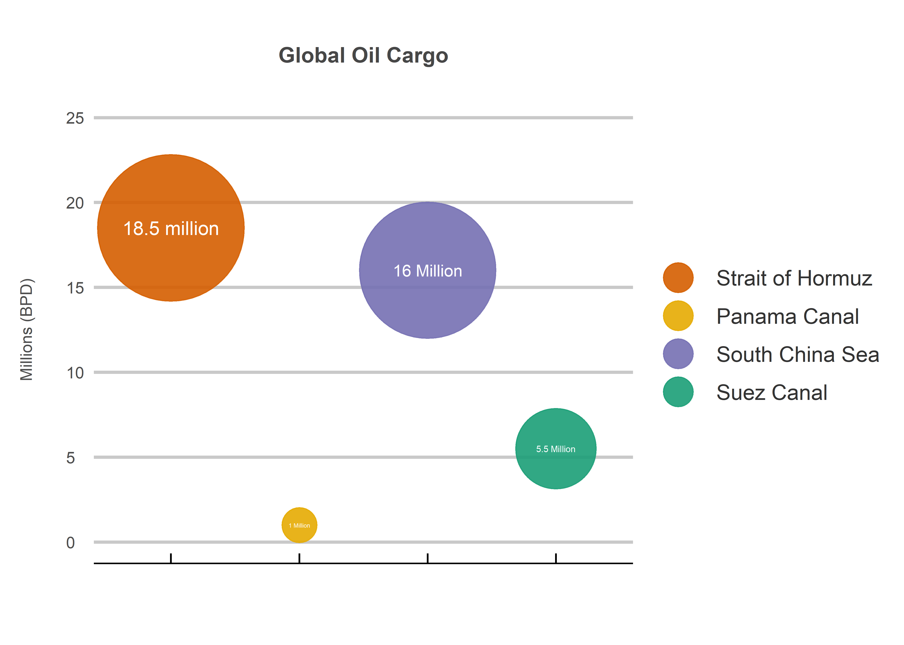
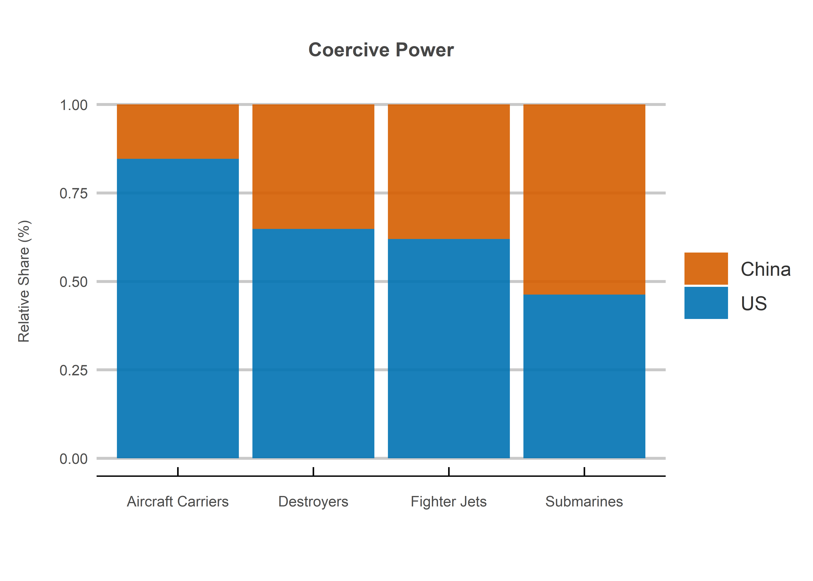

The South China Sea
================
Jack Carter
1/9/2021

## **Executive Summary**

The South China Sea is a region of vital geo-strategic importance. This
appears to have fueled a series of increasingly contested maritime
claims between China, Malaysia, the Philippines, Taiwan and Vietnam in
recent decades. China’s growing regional dominance prompted the US
to step up its local military presence in 2012. The resulting
balance of power however could be short lived if the Chinese economy continues
to grow in the future.

The rest of the report analyzes the dispute in the context of the
region’s strategic importance, China’s regional dominance and the
China-US balance of power. It is organized into the following sections:

1.  The Region
2.  The Claimants  
3.  The Superpowers

 

## **1. The Region**

1.1: The approximate value of regional resources in US Dollars *(CSIS,
2016: CSIS, 2021: Teh et.al., 2019)*.

<!-- -->

1.2: The approximate value of various trade routes in US Dollars *(CSIS,
2016: Allianz, 2016: Osler, 2019: Kenawy, 2015)*.

<!-- -->

1.3: The approximate volume of various oil cargo routes in barrels per
day *(EIA, 2017)*.

<!-- -->

## **Regional Summary**

The region is characterized by tremendous strategic importance as a
result of its abundance of estimated oil and gas reserves, fish supplies
and international trade flows.

Hydrocarbon reserves and fish supplies are a significant source of
income, yet they are easily overshadowed by international trade. The
region is not only home to the world’s largest trade route, but also the
second largest crude oil transportation route. This makes it a crucial
choke point in the global economy and thus a vital geo-strategic
interest.

 

## **2. The Claimants**

2.1: Regional influence by total land, population, GDP and exports in
2021 *(Global Firepower, 2021, CSIS, 2016)*.

<!-- -->

2.2: Mlitary spending between 1990 and 2019 *(World Bank, 2019)*.

<!-- -->

3.3: Coercive power in 2021 *(Global Firepower, 2021)*.

<!-- -->

## **Claimant Summary**

The claimants are characterized by a high degree of inequality in both
size and capabilities. China has by far the largest landmass,
population, GDP and regional trade flows.

This suggests that the dispute is highly one-sided in terms of raw power
capabilities, an intuition borne out by the fact that China has now
militarized more islands than all of the other claimants combined. It
appears to be for this reason that the US has stepped up its regional
military presence since 2012.

 

## **3. The Superpowers**

3.1: Global influence by total land, population, GDP and exports
*(Global Firepower, 2021: CSIS, 2016: World Bank, 2019)*.

<!-- -->

3.2: Military spending between 1990 and 2019 *(World Bank, 2019)*.

<!-- -->

3.3: Coercive power in 2021 *(Global Firepower, 2021)*.

<!-- -->

## **Superpower Summary**

The China-US balance of power currently appears to be in the US’s favor
as it has superior military capabilities.

China’s much larger population however means that this could change if
its economy continues to grow in the future. This is especially relevant
for the prospect of regional conflict, as China would be operating in
waters much closer to home and thus likely have a strategic advantage.

 

## **Sources**

  - Allianz (2016)
    <https://www.agcs.allianz.com/news-and-insights/reports/panama-canal-expansion.html>

  - CSIS (2016) <https://chinapower.csis.org/>

  - CSIS (2021) <https://amti.csis.org/>

  - EIA (2017) <https://www.eia.gov/todayinenergy/detail.php?id=39932>

  - Global Firepower (2021) <https://www.globalfirepower.com/>

  - Kenawy (2015) <http://oaji.net/articles/2017/3667-1488117386.pdf>

  - Osler (2019)
    <https://lloydslist.maritimeintelligence.informa.com/LL1127721/>

  - Teh (2019)
    <https://oceans.ubc.ca/research/publications/research-reports/>

  - World Bank (2019) <https://data.worldbank.org/>
