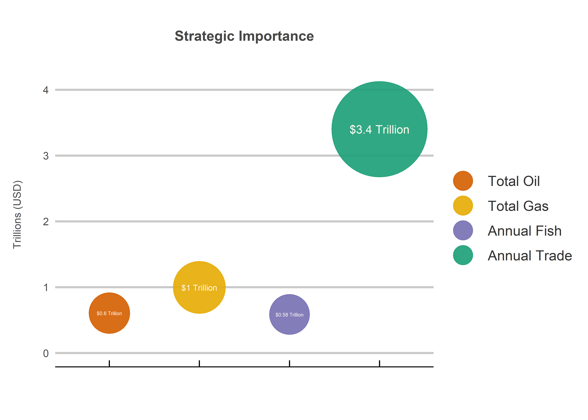

The South China Sea Dispute
================
Jack Carter
1/9/2021

## **1. The Region**

### **1.1: Resources**

Expressed as an estimate value of the region’s total oil reserves, total
natural gas reserves, annual fish stock and annual maritime trade in US
Dollars *(CSIS, 2015)*.

<!-- -->

The data shows that while oil, natural gas and fish are important, trade
appears to be the most significant source of regional wealth. This
suggests that control over the waterway is primarily sought after due to
its ability to safeguard access to global markets.

 

### **1.2: Trade Routes**

Expressed as total trade in trillions of US Dollars for selected global
shipping lanes *(CSIS, 2021)*.

<!-- -->

The data shows that the South China Sea is significant global shipping
lane for total trade respectively.

 

### **1.3: Regional Trade**

Expressed as the claimants’ import value, export value and the
percentage of their total trade which passed through the South China Sea
in 2016 *(CSIS, 2016)*.

<!-- -->

The data shows that China’s regional trade is far higher than that of
the other claimants. This suggests that it potentially has more to lose
if this global sea lane faces disruptions.

 

## **2. The Claimants**

### **2.1: Regional Influence**

Expressed as total land, population and gross domestic product (GDP) in
2021 *(Global Firepower, 2021)*.

<!-- -->

The data shows a significantly larger landmass, population and GDP for
China. This suggests that the country likely has far greater coercive
abilities vis a vis its smaller neighbors.

 

### **2.2: Military Spending**

Expressed as military spending between 1990 and 2020 *(World Bank,
2020)*.

<!-- -->

The data shows that China’s military spending has far outpaced the
others, especially from 2000 to 2020. This suggests that China has a far
more capable military than its smaller neighbors.

 

### **2.3: Military Capabilities**

Expressed as military personnel, aircraft fleet, navy fleet and
Submarines in 2021 *(Global Firepower, 2021)*.

<!-- -->

The data shows far greater military capabilities for China. It also
shows how China’s most overwhelming capability compared to the others is
its navy, suggesting that it may have prioritized this arm of the
military in response to the ongoing dispute.
